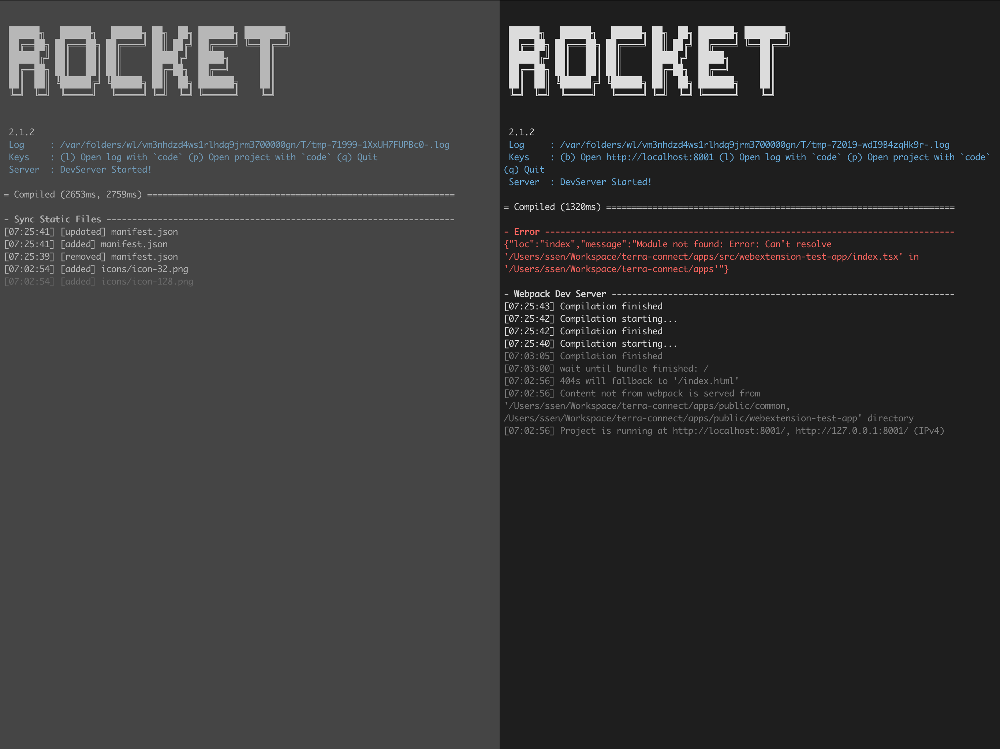

> This is still under development. Disclosure of this Repo is intended to provide references to Web Extension-compatible Wallet developers. 

# Development

## 1. Run development

```sh
yarn install
cd apps
yarn run webextension:dev
```

## 2-1. Chrome

1. Go to `chrome://extensions` page
2. Turn on "Developer mode" on right top corner
3. Click "Load unpacked"
4. Choose the `~/apps/dev/webextension` directory

## 2-2. Firefox

1. Go to `about:debugging`
2. Go to "This firefox"
3. Click "Load Temporary Add-on"
4. Choose the `~/apps/dev/webextension` directory

## 2-3. Safari

1. Allow `Develop / Allow Unsigned Extensions` on the Safari Menubar
2. Open XCode project the `~/safari-webextension/terra-connect`
3. Run

## 3. Debugging Web and Web Extension



1. Open `http://localhost:8001` (see the second terminal `keys` line)
